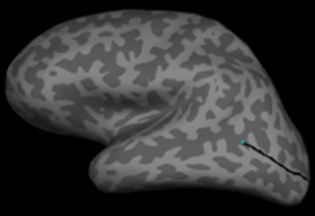

# A fMRI Study: Occipital Surface Extraction from Cortical Surface Model

## Overview
Today, functional connectivity analyzes based on Functional Magnetic Resonance Imaging (fMRI) data and detecting neuronal activity in the brain have gained an important place in brain research. The physical basis of fMRI depends to blood-oxygen-level-dependent (BOLD) contrast which derived from a mismatch of blood flow and oxygen metabolism during local neural activation. Studies of how the brain represents complex visual objects and the perception experienced by the subject are extremely important in terms of understanding the working of the brain.

In this repository, there are studies on visual stimulus reconstruction from fMRI activation models, which are revealed by the presentation of visual stimuli in various object categories. In terms of applicability of statistical learning approaches involving neuroscience, [the BOLD5000 dataset](https://bold5000-dataset.github.io/website/) containing approximately 5,000 different slow event-related fMRI human functional MRI (fMRI) images will be used. As data preprocessing steps, it is aimed to increase the classification accuracy by removing the visual cortex, which is known to contain information about the distinctions to be made, from the images. It is aimed to test the performance of deep learning-based algorithms with 2 different data types: The first is to extract the cortical surface model for each subject, in which the stimulus image hides the neighborhood relations, using [Freesurfer software](https://surfer.nmr.mgh.harvard.edu/). Secondly, the performance of the algorithm in creating the stimulus image using raw images will be analyzed. The generative adversarial network (GAN) architecture, which is often used in the machine learning framework, will be used to reconstruct the stimulus image from the pre-processed and raw images. 

## Table of Contents
1. [DICOM Mosaics to Patient Coordinate System Mapping](#DICOM-Mosaics-to-Patient-Coordinate-System-Mapping)
2. [FreeSurfer Single Subject Pipeline Analysis Overview](#FreeSurfer-Single-Subject-Pipeline-Analysis-Overview)
3. [Occipital Patch Removal from Cortical Surface and Flattening](#Occipital-Patch-Removal-from-Cortical-Surface-and-Flattening)
4. [Volume to Surface Projection using Freesurfer](#Volume-to-Surface-Projection-using-Freesurfer)
5. [Flattened fMRI Activity Surfaces and Concatenate Both LH and RH](#Flattened-fMRI-Activity-Surfaces-and-Concatenate-both-LH-and-RH)
6. [References](#References)

## DICOM Mosaics to Patient Coordinate System Mapping
This Python script processes image files within a specified directory structure, creates a target folder, and organizes these files by converting them into the desired format using the FreeSurfer command. We saved mosaic T1-weighted images in NIfTI format. Check [mri_convert](https://surfer.nmr.mgh.harvard.edu/fswiki/mri_convert)

```bash
python3 mri_convert.py
```

<div align="center">
<table>
  <tr>
    <td> </td>
    <td> </td>
  </tr>
  <tr>
    <td colspan="2" style="text-align:center;">Figure: DICOM mosaics to 3D volume data transformation</td>
  </tr>
</table>
</div>

## FreeSurfer Single Subject Pipeline Analysis Overview

Recon-all provides pre-processing of the three-dimensional anatomical volume of a single subject. Check out the [Freesurfer tutorial](https://andysbrainbook.readthedocs.io/en/latest/FreeSurfer/FS_ShortCourse/FS_03_ReconAll.html) on the usage and outputs of the recon-all command.

```bash
$ recon-all -i T1w_MPRAGE_CSI1.nii.gz -s CSI1 -all
```
where **-i** flag is anatomical images, **-s** is subject name and **-all** flag will run all of the preprocessing steps on your data.

<p align="center">
  
</p>

## Occipital Patch Removal from Cortical Surface and Flattening
TkSurfer tool in Freesurfer toolset was used to create occipital patches. TkSurfer allows for visualization and navigation through cortical surface data. TkSurfer can also display functional or curvature data on the surface. Take a look [TkSurfer](https://surfer.nmr.mgh.harvard.edu/fswiki/tksurfer).

Brodmann V1 and V2 regions created during the cortical reconstruction process completed with recon-all were used in the occipital patch extraction process. Take a look [Broddman Areas](https://surfer.nmr.mgh.harvard.edu/fswiki/BrodmannAreaMaps).

```bash
$ tksurfer CSI1 *h inflated -gray
```

<p align="center">
  
</p>

The following cutting steps are applied to both hemispheres.

<table border="1" style="border-collapse: collapse; width: 100%; text-align: center; table-layout: fixed;">
  <colgroup>
    <col style="width: 33%;">
    <col style="width: 33%;">
    <col style="width: 33%;">
  </colgroup>
  <tr>
    <td style="vertical-align: middle; word-wrap: break-word; overflow-wrap: break-word;">
      
      <p><strong>1</strong> tksurfer CSI1 lh inflated -gray</p>
    </td>
    <td style="vertical-align: middle; word-wrap: break-word; overflow-wrap: break-word;">
      
      <p><strong>2</strong> Rotate around to view the occipital pole. Click a point to mark the posterior end of the relief-cut line.</p>
    </td>
    <td style="vertical-align: middle; word-wrap: break-word; overflow-wrap: break-word;">
      
      <p><strong>3</strong> Rotate back to the lateral view. Add a couple more points to define the line.</p>
    </td>
  </tr>
  <tr>
    <td style="vertical-align: middle; word-wrap: break-word; overflow-wrap: break-word;">
      
      <p><strong>4</strong> Click ‘Cut line’ button after adding the points.</p>
    </td>
    <td style="vertical-align: middle; word-wrap: break-word; overflow-wrap: break-word;">
      
      <p><strong>5</strong> Output of the ‘Cut line’ process.</p>
    </td>
    <td style="vertical-align: middle; word-wrap: break-word; overflow-wrap: break-word;">
      
      <p><strong>6</strong> Click on the anterior end of the calcarine sulcus.</p>
    </td>
  </tr>
  <tr>
    <td style="vertical-align: middle; word-wrap: break-word; overflow-wrap: break-word;">
      
      <p><strong>7</strong> Click points as desired to define the occipital patch boundary.</p>
    </td>
    <td style="vertical-align: middle; word-wrap: break-word; overflow-wrap: break-word;">
      
      <p><strong>8</strong> Click the ‘Cut plane’ button to finalize the patch.</p>
    </td>
    <td style="vertical-align: middle; word-wrap: break-word; overflow-wrap: break-word;">
      
      <p><strong>9</strong> Save the patch as lh.occip.patch.mgh.</p>
    </td>
  </tr>
  <tr>
    <td style="vertical-align: middle; word-wrap: break-word; overflow-wrap: break-word;">
      
      <p><strong>10</strong> Run mris_flatten to flatten the patch.</p>
    </td>
    <td style="vertical-align: middle; word-wrap: break-word; overflow-wrap: break-word;">
      
      <p><strong>11</strong> Load Brodmann V1 and V2 labels.</p>
    </td>
    <td style="vertical-align: middle; word-wrap: break-word; overflow-wrap: break-word;">
      
      <p><strong>12</strong> Final output with loaded Brodmann areas.</p>
    </td>
  </tr>
</table>

The occipital patches cut from the cortical surface are flattened for each hemisphere.
```bash
handenur@handenur-VirtualBox:/usr/local/freesurfer/subjects/CSI1/surf$ mris_flatten -w 0 lh.occip.patch.mgh lh.occip.flat.mgh
handenur@handenur-VirtualBox:/usr/local/freesurfer/subjects/CSI1/surf$ mris_flatten -w 0 rh.occip.patch.mgh rh.occip.flat.mgh
```

## Volume to Surface Projection using Freesurfer
This script is designed to project volumetric fMRI images onto surface models using the `mri_vol2surf` command from the FreeSurfer software for volume-to-surface registration.

```bash
python3 registration.py
```
<div align="center">
<table>
  <tr>
    <td> </td>
    <td> </td>
  </tr>
  <tr>
    <td colspan="2" style="text-align:center;">Figure: fMRI Activation Projection on Cortical Surface</td>
  </tr>
</table>
</div>

### Flattened fMRI Activity Surfaces and Concatenate Both LH and RH
Flat surfaces were filled with activation values using linear interpolation method. Check out [LinearNDInterpolator](https://docs.scipy.org/doc/scipy/reference/generated/scipy.interpolate.LinearNDInterpolator.html) function in Scipy.

```bash
python3 flatmap.py
```


```bash
python3 lh_rh_concat.py
```

<p align="center">
  
</p>

## References
1. [Generative adversarial networks for reconstructing natural images from brain activity](https://www.sciencedirect.com/science/article/abs/pii/S105381191830658X)
2. [BOLD5000, a public fMRI dataset while viewing 5000 visual images](https://www.nature.com/articles/s41597-019-0052-3)
3. [End-to-End Image Reconstruction of Image from Human Functional Magnetic Resonance Imaging Based on the "Language" of Visual Cortex](https://dl.acm.org/doi/abs/10.1145/3404555.3404593)
4. [Functional magnetic resonance imaging (fMRI)"brain reading": detecting and classifying distributed patterns of fMRI activity in human visual cortex](https://www.sciencedirect.com/science/article/abs/pii/S1053811903000491?dgcid=api_sd_search-api-endpoint)
5. [fMRI Brain Reading: detecting and classifying distributed patterns of fMRI activity in human visual cortex](https://d1wqtxts1xzle7.cloudfront.net/2554105/1dcgsz4gzkx575a-with-cover-page-v2.pdf?Expires=1661704315&Signature=XowmBMW1DrfDZXALg5N1Kv4-aGzVwVV5rWFmI4UdnefniI~~f~Bcgtsx9Nj6awUbDAJFZKnOTEjWKs1RutB4suKGmk6Aevdy-si6A5CEIuMX6pI5sDkXqbWxLBkkY8bgKRXSBkBUjc0EB3DJ9mwj-R6M-da7anqbAJYhgDOffskvsNMxy5l8g1aVsYG1zUoqIbZjrSF4hsVhF-GWQQ3cGb97QNzD2uw-7iYXcdYIXDsCty~gOTdahFrBDVbI95f1KakNYsy-6h4W3ilWwBMyB5bPWHN6v7jfNG5xCauq2RtAonFCZFgsCPZlfeBp24fbujCxe6XXMcB94JOYzCbSGw__&Key-Pair-Id=APKAJLOHF5GGSLRBV4ZA)
